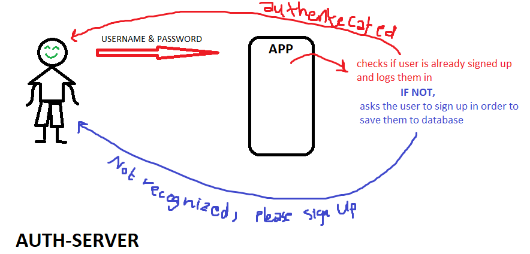

# LAB 11: auth-server

## Lab: Auth-Server
## Author: Darah

# Links and Resources

- [submission PR](https://github.com/Darah98/auth-server/pull/1)

- [ci/cd](https://github.com/Darah98/auth-server/actions/runs/131465447)

# Setup

## How to initialize/run your application

- To run application: npm start index.js

# UML 

